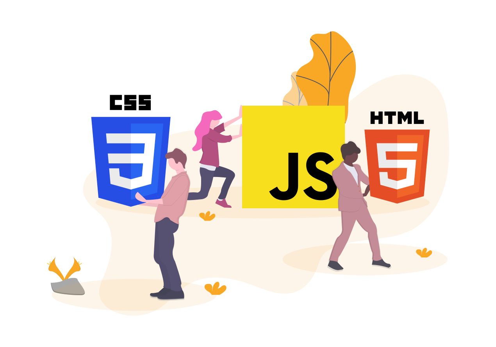

<!-- PROJECT SHIELDS -->

[![MIT License][license-shield]][license-url]

<!-- PROJECT LOGO -->

  
    
  
  <h3 align="center">Challenge form</h3>
  

   Creation of a web form from scratch to upload to a cloud service
  

<!-- ABOUT THE PROJECT -->

## About The Project

### Built With

This project is built with

- [Javascript](https://developer.mozilla.org/es/docs/Learn/JavaScript/First_steps/Qu%C3%A9_es_JavaScript)
- [html](https://developer.mozilla.org/es/docs/Web/HTML)
- [css](https://developer.mozilla.org/es/docs/Web/CSS)
<!-- GETTING STARTED -->

## Contributing

1.  Fork the project
2.  Create your feature branch (`git checkout -b feature/AmazingFeature`)
3.  Commit your changes (`git commit -m 'Add some AmazingFeature'`)
4.  Push to the branch (`git push origin feature/AmazingFeature`)
5.  Open a pull request

## License

Distributed under the MIT License. See `LICENSE` for more information.

<!-- CONTACT -->

## Contact

Fernando Cúmez - [@fernancumez](https://twitter.com/fernancumez) - fernancumez@gmail.com

Link Proyecto: [https://github.com/fernancumez/photo-gallery-api.git](https://github.com/fernancumez/photo-gallery-api.git)

Url: [https://fernancumez.github.io/reto-formulario/](https://fernancumez.github.io/reto-formulario/)

<!-- MARKDOWN LINKS & IMAGES -->
<!-- https://www.markdownguide.org/basic-syntax/#reference-style-links -->

[license-shield]: https://img.shields.io/github/license/othneildrew/Best-README-Template.svg?style=flat-square
[license-url]: https://github.com/fernancumez/dino-chrome/blob/main/LICENSE
